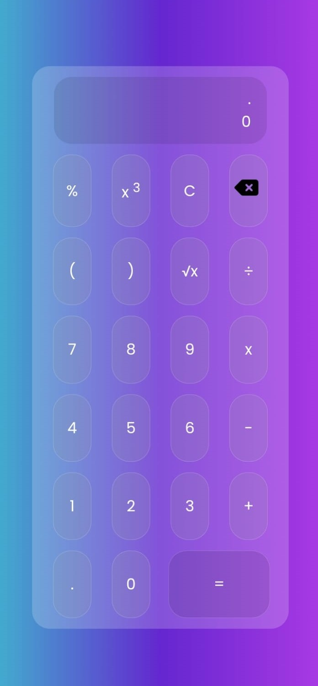

<h1 align="center"> Calculadora basica </h1>

<h2>Version DEMO</h2>
<a href="https://calculadora-cool.netlify.app/">https://calculadora-cool.netlify.app/</a>

<h2>Portada</h2>

<h2>Tecnologias Usadas</h2>
<ul>
<li>HTML 5</li>
<li>CSS 3</li>
<li>JavaScript</li>
</ul>

<h2>Autor</h2>
